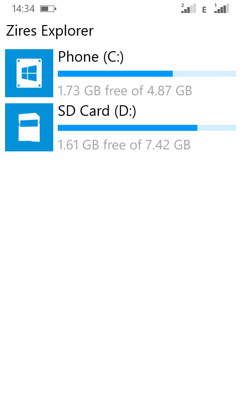

# Zires-File-Explorer

### Windows phone file manager

This file manager was built in 2013 for Windows Phone 8.0

## Technologies
<b>Windows phone</b> 
Language: <b>C#</b> 
<b>MVVM</b> architecture is used to develop this program. 
Uses <b>Data binding</b> to bind lists to display layers. 
Create views with <b>xaml</b> (<b>Pivot</b>, <b>Grid</b>, <b>ScrollViewer</b>, <b>Style</b>, <b>VisualStateManager</b>, <b>Storyboard</b>, <b>LongListSelector</b>)

## Feature
Manage file and folder (Create. Delete, Rename, Properties, Cut, Copy, Share) 
<b>Image Viewer</b> in App 
<b>Music Player</b> in App and Play the music in Background (with Control buttons) - play music and continue exploring 
<b>Video Player</b> in App 

